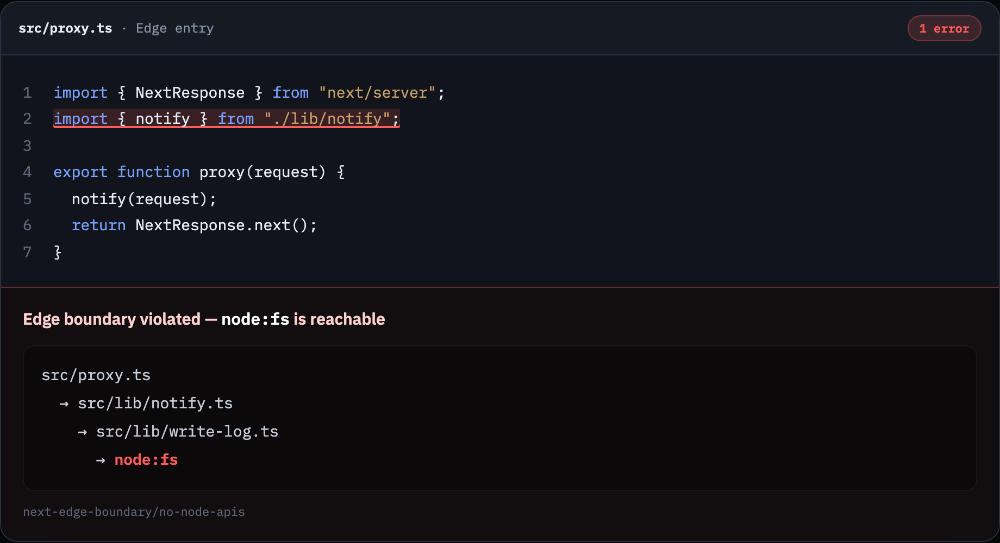

# eslint-plugin-next-edge-boundary

Your Edge entry doesn’t fail the build. It just gets slower every PR. This rule fails the PR instead.

One convenient import in `middleware.ts` or Next 16 `proxy.ts` can drag in `node:fs` three files deep — or a 400KB local graph — while `next build` still passes. This plugin fails that PR in the editor / CI, on the entry import, with the chain.

<p align="center">
  
</p>

The squiggle sits on `./lib/notify` — not on a leaf deep in the tree. That is the point.

## Before / after

```ts
// ❌ proxy.ts — “just reuse notify”
import { notify } from "./lib/notify";
```

```ts
// ✅ proxy.ts — thin Edge slice
import { notifyEdge } from "./lib/notify-edge";
```

Banning `fs` on the entry file is not enough. The leak is almost always transitive. Byte bloat happens even when nothing Node-shaped shows up — so there is a graph size budget too.

## Install

```bash
pnpm add -D eslint-plugin-next-edge-boundary
```

Peer: `eslint` `>=9`. Optional: `typescript`.

### Flat config

```js
import nextEdgeBoundary from "eslint-plugin-next-edge-boundary";

export default [
  {
    files: [
      "middleware.ts",
      "src/middleware.ts",
      "proxy.ts",
      "src/proxy.ts",
    ],
    ...nextEdgeBoundary.configs.recommended,
  },
];
```

Use `configs.strict` for a 32 KiB budget and barrels as errors. Legacy eslintrc: `configs["recommended-legacy"]` / `configs["strict-legacy"]`.

## Rules

| Rule | What it catches |
| ---- | ---------------- |
| `next-edge-boundary/no-node-apis` | Value-import graph reaches Node builtins (`fs` / `node:fs`, …) or a denylist package (`sharp`, `pg`, `mongodb`, …) |
| `next-edge-boundary/max-graph-bytes` | Estimated local source graph exceeds the budget (64 KiB recommended, 32 KiB strict) |
| `next-edge-boundary/no-barrels` | Entry imports of barrels (`@/lib`, `@/utils`, …) or `import * as` namespaces |

`import type` / `export type` are ignored — they erase at compile time.

### recommended vs strict

| | recommended | strict |
| - | ----------- | ------ |
| `no-node-apis` | error | error |
| `max-graph-bytes` | error · `max: 65536` | error · `max: 32768` |
| `no-barrels` | warn | error |

## Why not `no-restricted-imports` / Next build alone

| Approach | Gap |
| -------- | --- |
| `no-restricted-imports` | Direct specifiers only. No transitive walk, no size budget, no chain. |
| Next / Edge build | Often fails late, and mainly on hard Node APIs. Quiet size regression can ship for weeks. |
| This plugin | Transitive graph + byte budget + chain on the entry import, at lint time. |

## Options

Shared on every rule:

```ts
{
  allowModules?: string[];
  denyModules?: string[];
  ignorePatterns?: string[];
  tsconfigPath?: string;
  allowImportChains?: string[][]; // last resort
}
```

`max-graph-bytes`: `max`, `includeNodeModules`, `packageWeights`  
`no-barrels`: `barrelPatterns`, `forbidNamespaceImports`

## Entrypoints

Matched by basename: `middleware.ts` / `.js`, `proxy.ts` / `.js` (Next.js 16). Scope them with ESLint `files` as above.

## Limitations

- Dynamic `import()` is ignored in v1
- Not a bundler — local source byte estimate, not Turbopack/webpack output
- App Router `export const runtime = 'edge'` detection is not in v1

## License

MIT
